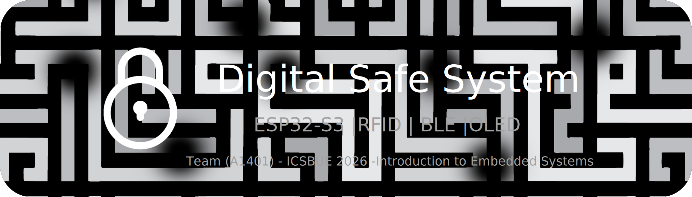

<p align="center">
  
</p>

<h1 align="center">🔐 Digital Safe System</h1>

<p align="center">
  <strong>A multi-authentication embedded security system built with ESP32-S3</strong>
</p>

<p align="center">
  <a href="#features">Features</a> •
  <a href="#hardware">Hardware</a> •
  <a href="#installation">Installation</a> •
  <a href="#usage">Usage</a> •
  <a href="#simulation">Simulation</a> •
  <a href="#team">Team</a>
</p>

<p align="center">
  
  
  
  
</p>

---

## 📋 Overview

The **Digital Safe System** is an embedded systems project for the *Introduction to Embedded Systems (25CSCI11C)* course at the British University in Egypt (BUE). It implements a secure, multi-authentication locking mechanism using an ESP32-S3 microcontroller.

The system supports **three authentication methods**: keypad password, RFID card scanning, and Bluetooth Low Energy (BLE) remote control — all with real-time feedback via an OLED display, LEDs, and a buzzer.

## ✨ Features

| Feature | Description |
|---------|-------------|
| **4-Digit Password** | Set, change, and enter passwords via a 4×4 keypad with masked input |
| **Dual Input Mode** | Switch between numeric (KEYPAD) and character (CHAR) mode using `*` key |
| **RFID Authentication** | Register and authenticate with MFRC522 RFID cards for one-tap unlock |
| **BLE Remote Control** | Lock, unlock, check status, and change password from any BLE terminal app |
| **Servo Latch** | Continuous rotation servo physically locks/unlocks the safe door |
| **Security Lockout** | 4 wrong attempts triggers escalating lockout (30s → 60s → 120s → ...) |
| **Master Code** | Emergency recovery code (default: `0000`) to override lockout |
| **OLED Animations** | Splash screen, loading bar, lock/unlock animations, checking progress bar |
| **EEPROM Persistence** | Password and RFID UID survive power cycles |
| **LED + Buzzer Feedback** | Visual and audio feedback for every interaction |

## 🔌 Hardware

### Components

| Component | Model | Interface | GPIO Pin(s) |
|-----------|-------|-----------|-------------|
| Microcontroller | ESP32-S3 DevKitC-1 | - | - |
| OLED Display | 1.5" SH1107 128×128 | I2C | SDA=8, SCL=9 |
| RFID Reader | MFRC522 | SPI | SS=10, RST=14, SCK=12, MOSI=11, MISO=13 |
| Keypad | 4×4 Membrane | Digital | Rows: 1,2,42,41 — Cols: 40,39,38,37 |
| Servo Motor | SG90 (continuous) | PWM | 18 |
| Red LED | 5mm (+ 220Ω resistor) | Digital | 15 |
| Green LED | 5mm (+ 220Ω resistor) | Digital | 16 |
| Buzzer | Active 5V | Digital | 17 |
| Bluetooth | ESP32-S3 built-in BLE | - | Internal |

### Wiring Diagram

```
ESP32-S3 DevKitC-1
┌──────────────────────────────────┐
│                                  │
│  GPIO 8  ──── OLED SDA           │
│  GPIO 9  ──── OLED SCL           │
│  3V3     ──── OLED VCC           │
│                                  │
│  GPIO 10 ──── RFID SDA(SS)       │
│  GPIO 14 ──── RFID RST           │
│  GPIO 12 ──── RFID SCK           │
│  GPIO 11 ──── RFID MOSI          │ 
│  GPIO 13 ──── RFID MISO          │
│  3V3     ──── RFID 3.3V          │
│                                  │
│  GPIO 18 ──── Servo Signal       │
│  5V(VIN) ──── Servo VCC          │
│                                  │
│  GPIO 15 ─┬── 220Ω ── Red LED    │
│  GPIO 16 ─┬── 220Ω ── Green LED  │
│  GPIO 17 ──── Buzzer +           │
│                                  │
│  GPIO 1,2,42,41 ── Keypad Rows   │
│  GPIO 40,39,38,37 ── Keypad Cols │
│                                  │
│  GND ──── All component GNDs     │
└──────────────────────────────────┘
```

> ⚠️ **RFID runs on 3.3V only** — never connect to 5V. Servo needs 5V from the VIN pin.

## 🚀 Installation

### Prerequisites

- [Arduino IDE 2.x](https://www.arduino.cc/en/software)
- ESP32 Board Package by Espressif (add URL in Preferences):
  ```
  https://raw.githubusercontent.com/espressif/arduino-esp32/gh-pages/package_esp32_index.json
  ```

### Required Libraries

Install via **Sketch → Include Library → Manage Libraries**:

| Library | Purpose |
|---------|---------|
| `MFRC522` | RFID reader |
| `Adafruit SH110X` | OLED display (SH1107) |
| `Adafruit GFX Library` | Graphics primitives |
| `ESP32Servo` | Servo motor control |
| `Keypad` | 4×4 matrix keypad |

> BLE libraries are built into the ESP32 Arduino core — no extra install needed.

### Upload Steps

1. Open `src/real_hardware/DigitalSafe_A1401.ino` in Arduino IDE
2. Select board: **ESP32S3 Dev Module**
3. Set **USB CDC On Boot: Enabled**
4. Select your COM port
5. Click **Upload**

## 📖 Usage

### Keypad Controls

| Key | Action |
|-----|--------|
| `0-9` | Enter password digits |
| `#` | Confirm / Submit |
| `*` | Cancel / Toggle CHAR mode |
| `A` | Change password |
| `B` | Register RFID card |
| `D` | Enter master code |

### Input Modes

- **KEYPAD mode** (default): keys `0-9` enter digits directly
- **CHAR mode**: press `*` with empty input to switch. Keys map to letters (1→A, 2→B, ... 0→J, A→K, etc.). Press `*#` to return to KEYPAD mode.

### BLE Commands

Connect to **"DigitalSafe_A14"** using any BLE terminal app (e.g., nRF Connect).

| Command | Description |
|---------|-------------|
| `PASS:1234` | Unlock with password |
| `LOCK` | Lock the safe |
| `STATUS` | Check current state |
| `CHPASS:5678` | Change password remotely |

### Default Credentials

| Credential | Value |
|------------|-------|
| Password | `1234` |
| Master Code | `0000` |

### Security Flow

```
Wrong password × 4 → LOCKOUT (30s)
    → Wrong again × 4 → LOCKOUT (60s)
        → Wrong again × 4 → LOCKOUT (120s)
            → Doubles each cycle...
```

During lockout, **all methods are blocked** (keypad, RFID, BLE, master code). The system automatically unlocks after the timer expires.

## 🖥️ Simulation

### Wokwi Online Simulator

1. Go to [wokwi.com](https://wokwi.com) → New Project → ESP32-S3
2. Replace the files with:
   - `src/wokwi_simulation/sketch.ino`
   - `src/wokwi_simulation/diagram.json`
   - `src/wokwi_simulation/libraries.txt`
3. Click **Play**

### Simulation Differences

| Feature | Real Hardware | Wokwi |
|---------|-------------|-------|
| Bluetooth | BLE (built-in) | Serial Monitor |
| EEPROM | Persistent | Resets each run |
| OLED | SH1107 (I2C) | Grove SH1107 |
| First-run setup | Yes | Skipped (defaults) |

### Serial Monitor Commands (Wokwi)

```
PASS:1234    → Unlock
LOCK         → Lock
STATUS       → Check state
CHPASS:5678  → Change password
```

## 📁 Project Structure

```
Digital-Safe-System/
├── README.md
├── LICENSE
├── src/
│   ├── real_hardware/
│   │   └── DigitalSafe_A1401.ino    # Production code with BLE
│   └── wokwi_simulation/
│       ├── sketch.ino                # Wokwi-adapted code
│       ├── diagram.json              # Wokwi circuit layout
│       └── libraries.txt             # Wokwi library list
├── docs/
│   ├── report.docx                   # Project report
│   └── poster.html                   # A0 poster (print to PDF)
├── hardware/
│   ├── 3d_model/
│   │   └── DigitalSafe_Maquette.scad # OpenSCAD 3D model
│   └── circuit/
│       └── wiring_guide.md           # Pin-by-pin wiring
└── assets/
    └── banner.svg                    # Repo banner image
```

## 🏗️ 3D Printed Maquette

The safe enclosure is designed in [https://tinkercad.com/](https://www.tinkercad.com/) 3D Design with 3 printable parts:

**Print Settings:** PLA, 0.2mm layer height, 20% infill, no supports needed.

Open `hardware/3d_model/DigitalSafe_Maquette.scad` in [OpenSCAD](https://openscad.org), render (F6), and export each part as STL.

## 👥 Team

**Project A1401 — British University in Egypt — 2025/2026**

| Name | ID | Email |
|------|-----|-------|
| Zeina Alaaeldin | 254588 | zeina254588@bue.edu.eg |
| Zainab Sabit | 257156 | zainab257156@bue.edu.eg |
| Mahmoud Samir | 257678 | mahmoud257678@bue.edu.eg |
| Sondos Alaaeldin | 250362 | sondos250362@bue.edu.eg |
| Youssef Hassan | 257745 | youssef250498@bue.edu.eg |
| Ziad Youssef | 257745 | ziad257745@bue.edu.eg |

## 📄 License

This project is developed for academic purposes as part of the 25CSCI11C course at BUE.

---
